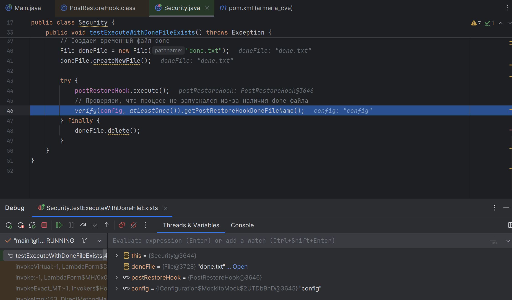

# Обзор #

## Описание уязвимости на github asvisory: ##
https://github.com/advisories/GHSA-f4jh-ww96-9h9j

## Описание уязвимости: ##
Когда File.createTempFile создает файл, разрешения на этот файл -rw-r--r--. Это означает, что другие пользователи могут читать содержимое этих файлов после их записи, хотя они не могут изменять содержимое. Это позволяет локально раскрывать информацию, если эти файлы содержат конфиденциальную информацию.

## Метод, приводящий к уязвимости ##
java.io.File.createTempFile

## Репозиторий проекта с уязвимостью: ##
https://github.com/Netflix/Priam

## PoC: ##
~~~java
File tempFile = File.createTempFile(prefix, suffix);
tempFile.setReadable(false);
tempFile.setWritable(false);
~~~

## Коммиты, исправившие уязвимость: ##
Отсутствуют

### Как исправить ###
В коде не делается проверка на права пользователя, так что для того, чтобы рещить проблему можно добавить эту проверку

# Анализ уязвимости #
1) 
2) 
3) 
4) 
5) 