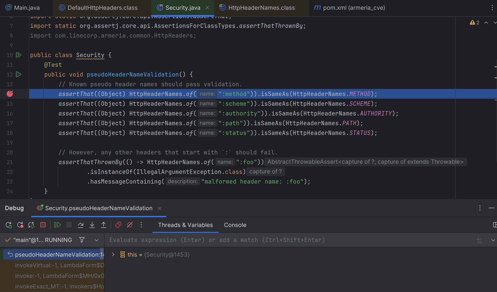
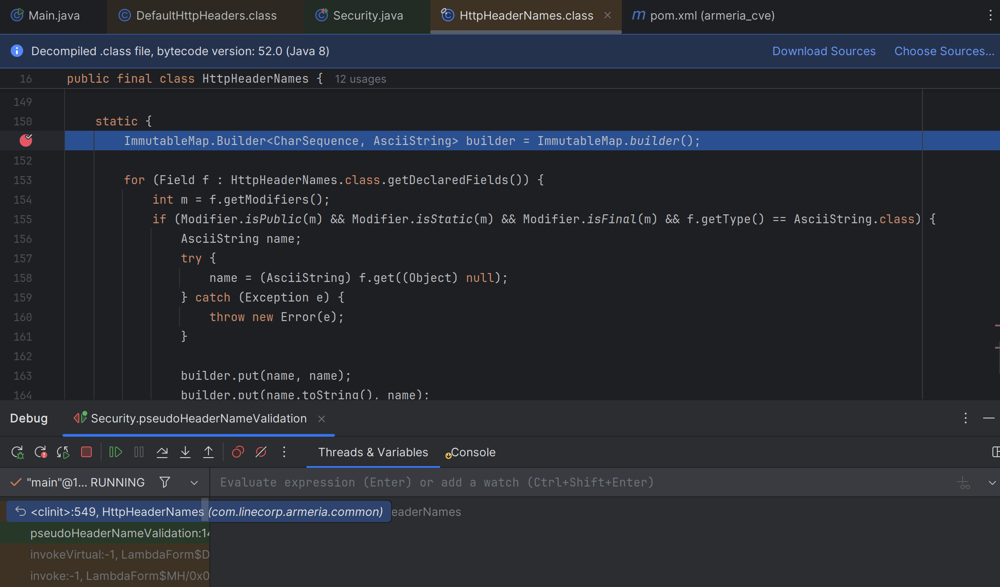
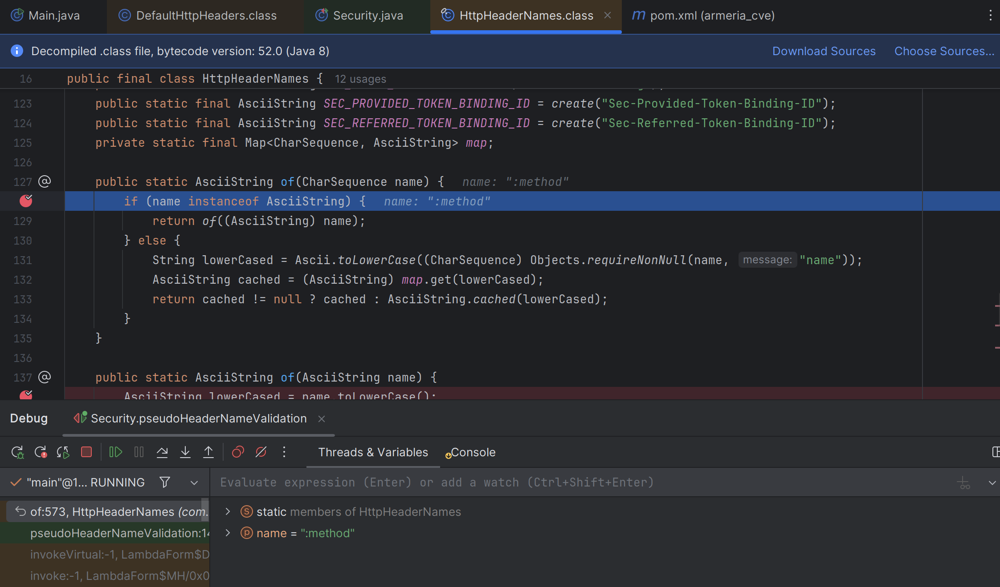
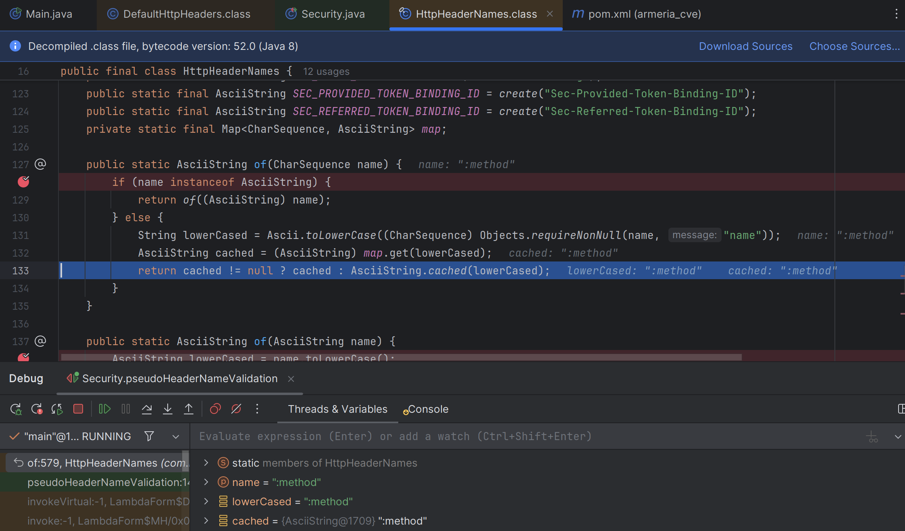
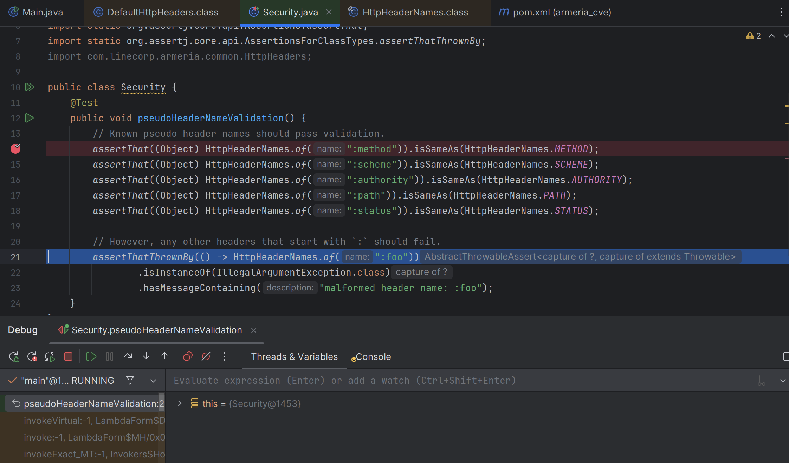

# Обзор #

## Описание уязвимости на github asvisory: ##
https://github.com/advisories/GHSA-24r8-fm9r-cpj2
https://github.com/line/armeria/security/advisories/GHSA-35fr-h7jr-hh86

## Описание уязвимости: ##
Метод сравнения строк в множественной проверке подлинности в Armeria, как известно, уязвим к атакам по времени. Эта уязвимость вызвана небезопасной реализацией метода equals из java.lang.String. Хотя эта атака практически невозможна, у злоумышленника все еще есть потенциал для атаки, если сервер жертвы проверяет пользователя с помощью метода equals.

## public метод пакета приводящий к уязвимости ##
CWE_2019-16771 - java.lang.String.equals
https://github.com/line/armeria/blob/f0d870fde1088114070be31b67f7df0a21e835c6/core/src/main/java/com/linecorp/armeria/common/DefaultHttpHeaders.java#L23

### class HttpHeaderNames ###

~~~java
public static AsciiString of(CharSequence name)
~~~

### Репозиторий проекта с уязвимостью: ###
https://github.com/line/armeria

## PoC: ##
~~~java
    @Test
     void pseudoHeaderNameValidation() {
         // Known pseudo header names should pass validation.
         assertThat((Object) HttpHeaderNames.of(":method")).isSameAs(HttpHeaderNames.METHOD);
         assertThat((Object) HttpHeaderNames.of(":scheme")).isSameAs(HttpHeaderNames.SCHEME);
         assertThat((Object) HttpHeaderNames.of(":authority")).isSameAs(HttpHeaderNames.AUTHORITY);
         assertThat((Object) HttpHeaderNames.of(":path")).isSameAs(HttpHeaderNames.PATH);
         assertThat((Object) HttpHeaderNames.of(":status")).isSameAs(HttpHeaderNames.STATUS);
 
         // However, any other headers that start with `:` should fail.
         assertThatThrownBy(() -> HttpHeaderNames.of(":foo"))
                 .isInstanceOf(IllegalArgumentException.class)
                 .hasMessageContaining("malformed header name: :foo");
     }
 
     @Test
     void headerNameValidation() {
         assertThatThrownBy(() -> HttpHeaderNames.of(""))
                 .isInstanceOf(IllegalArgumentException.class)
                 .hasMessageContaining("malformed header name: <EMPTY>");
         assertThatThrownBy(() -> HttpHeaderNames.of("\u0000"))
                 .isInstanceOf(IllegalArgumentException.class)
                 .hasMessageContaining("malformed header name: <NUL>");
         assertThatThrownBy(() -> HttpHeaderNames.of("\t"))
                 .isInstanceOf(IllegalArgumentException.class)
                 .hasMessageContaining("malformed header name: <TAB>");
         assertThatThrownBy(() -> HttpHeaderNames.of("\n"))
                 .isInstanceOf(IllegalArgumentException.class)
                 .hasMessageContaining("malformed header name: <LF>");
         assertThatThrownBy(() -> HttpHeaderNames.of("\u000B"))
                 .isInstanceOf(IllegalArgumentException.class)
                 .hasMessageContaining("malformed header name: <VT>");
         assertThatThrownBy(() -> HttpHeaderNames.of("\f"))
                 .isInstanceOf(IllegalArgumentException.class)
                 .hasMessageContaining("malformed header name: <FF>");
         assertThatThrownBy(() -> HttpHeaderNames.of("\r"))
                 .isInstanceOf(IllegalArgumentException.class)
                 .hasMessageContaining("malformed header name: <CR>");
         assertThatThrownBy(() -> HttpHeaderNames.of(" "))
                 .isInstanceOf(IllegalArgumentException.class)
                 .hasMessageContaining("malformed header name: <SP>");
         assertThatThrownBy(() -> HttpHeaderNames.of(","))
                 .isInstanceOf(IllegalArgumentException.class)
                 .hasMessageContaining("malformed header name: ,");
         assertThatThrownBy(() -> HttpHeaderNames.of(":"))
                 .isInstanceOf(IllegalArgumentException.class)
                 .hasMessageContaining("malformed header name: :");
         assertThatThrownBy(() -> HttpHeaderNames.of(";"))
                 .isInstanceOf(IllegalArgumentException.class)
                 .hasMessageContaining("malformed header name: ;");
         assertThatThrownBy(() -> HttpHeaderNames.of("="))
                 .isInstanceOf(IllegalArgumentException.class)
                 .hasMessageContaining("malformed header name: =");
     }
~~~

## Коммиты, исправившие уязвимость: ##
https://github.com/line/armeria/commit/b597f7a865a527a84ee3d6937075cfbb4470ed20

# Анализ уязвимости #
1) 
2) 
3) 
4) 
5) 
6) 
7) 